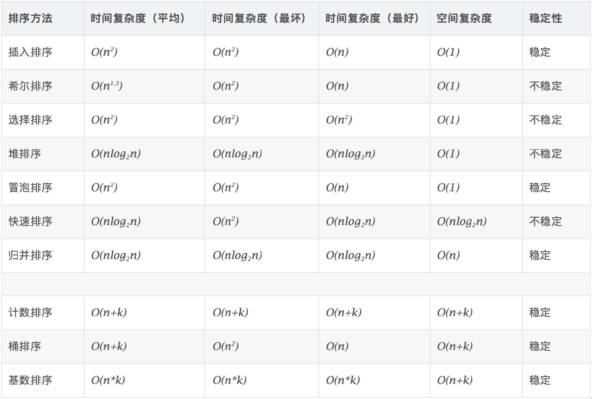

# 第八周学习笔记

## 一、位运算
### 运算符及含义
|运算符|含义|
|:---:|:---:|
|<<|左移|
|>>|右移|
|>>>|无符号右移|
|&|按位与|
|\||按位或|
|~|按位取反|
|^|按位异或|

### 位运算要点
•判断奇偶&nbsp;&nbsp;x % 2 == 1 ——> (x & 1) == 1    
&nbsp;&nbsp;&nbsp;&nbsp;&nbsp;&nbsp;&nbsp;&nbsp;&nbsp;&nbsp;&nbsp;&nbsp;&nbsp;&nbsp;&nbsp;&nbsp;&nbsp;
x % 2 == 0 ——> (x & 1) == 0    
•除以2&nbsp;&nbsp;&nbsp;x >> 1 ——> x / 2.    
&nbsp;&nbsp;即： x = x / 2; ——> x = x >> 1    
&nbsp;&nbsp;mid = (left + right) / 2; ——> mid = (left + right) >> 1    
•X = X & (X - 1) &nbsp;&nbsp;清零最低位的 1     
•X & (-X) &nbsp;&nbsp;&nbsp;得到最低位的 1    
•X & ~X => 0    
## 二、LRU Cache
最近最少使用的被替换
查询 O(1), 修改O(1)    
### Java实现
```
class LRUCache {

    class DLinkedNode {
        int key;
        int value;
        DLinkedNode pre;
        DLinkedNode next;
    }

    /**
     * Always add the new node right after head;
     */
    private void addNode(DLinkedNode node) {

        node.pre = head;
        node.next = head.next;

        head.next.pre = node;
        head.next = node;
    }

    /**
     * Remove an existing node from the linked list.
     */
    private void removeNode(DLinkedNode node) {
        DLinkedNode pre = node.pre;
        DLinkedNode post = node.next;

        pre.next = post;
        post.pre = pre;
    }

    /**
     * Move certain node in between to the head.
     */
    private void moveToHead(DLinkedNode node) {
        this.removeNode(node);
        this.addNode(node);
    }

    // pop the current tail.
    private DLinkedNode popTail() {
        DLinkedNode res = tail.pre;
        this.removeNode(res);
        return res;
    }

    private HashMap<Integer, DLinkedNode> cache;
    private int len;
    private int cap;
    private DLinkedNode head, tail;

    public LRUCache(int capacity) {
        cache = new HashMap<Integer, DLinkedNode>();
        this.len = 0;
        this.cap = capacity;

        head = new DLinkedNode();
        head.pre = null;

        tail = new DLinkedNode();
        tail.next = null;

        head.next = tail;
        tail.pre = head;
    }

    public int get(int key) {

        DLinkedNode node = cache.get(key);
        if (node == null) {
            return -1; // should raise exception here.
        }

        // move the accessed node to the head;
        this.moveToHead(node);

        return node.value;
    }


    public void put(int key, int value) {
        DLinkedNode node = cache.get(key);

        if (node == null) {

            DLinkedNode newNode = new DLinkedNode();
            newNode.key = key;
            newNode.value = value;

            this.cache.put(key, newNode);
            this.addNode(newNode);

            ++len;

            if (len > cap) {
                // pop the tail
                DLinkedNode tail = this.popTail();
                this.cache.remove(tail.key);
                --len;
            }
        } else {
            // update the value.
            node.value = value;
            this.moveToHead(node);
        }
    }
}
```

## 三、布隆过滤器
布隆过滤器可以用于检索一个元素是否在一个集合中。    
布隆过滤器说不存在的元素一定不存在。    
布隆过滤器说存在的元素不一定存在。    

## 四、排序算法
排序算法可分为基于比较的排序算法和非基于比较的排序算法。    
基于比较的排序算法有：选择排序，冒泡排序，插入排序，希尔排序，堆排序，快速排序，归并排序。    
非比较类排序有：计数排序，计数排序，桶排序。
### 各算法的时间和空间复杂度


### 1.冒泡排序
```
  public static void bubbleSort(int[] arr) {
    if (arr == null || arr.length < 2) {
      return;
    }
    for (int i = 0; i < arr.length - 1; i++) {
      for (int j = 1; j < arr.length - i; j++) {
        if (arr[j] < arr[j - 1]) {
          int temp = arr[j];
          arr[j] = arr[j - 1];
          arr[j - 1] = temp;
        }
      }
    }
  }
  ```


  ### 2.选择排序
  ```
  public static void selectionSort(int[] arr) {
    if (arr == null || arr.length < 2) {
      return;
    }
    for (int i = 0; i < arr.length - 1; i++) {
      for (int j = i + 1; j < arr.length; j++) {
        if (arr[j] < arr[i]) {
          int temp = arr[i];
          arr[i] = arr[j];
          arr[j] = temp;
        }
      }
    }
  }
  ```
  ### 3.插入排序
  ```
  public static void insertionSort(int[] arr) {
    if (arr == null || arr.length < 2) {
      return;
    }
    for (int i = 1; i < arr.length; i++) {
      for (int j = i; j > 0; j--) {
        if (arr[j] < arr[j - 1]) {
          int temp = arr[j];
          arr[j] = arr[j - 1];
          arr[j - 1] = temp;
        } else {
          break;
        }
      }
    }
  }
  ```

  ### 4.希尔排序
  ```
  public static void hillSort(int[] arr) {
    if (arr == null || arr.length < 2) {
      return;
    }
    for (int gap = arr.length / 2; gap > 0; gap /= 2) {
      for (int i = gap; i < arr.length; i++) {
        int j = i;
        while (j - gap >= 0 && arr[j] < arr[j - gap]) {
          int temp = arr[j];
          arr[j] = arr[j - gap];
          arr[j - gap] = temp;
          j -= gap;
        }
      }
    }
  }
  ```

  ### 5.堆排序
  ```
  public static void heapSort(int[] arr) {
    if (arr == null || arr.length < 2) {
      return;
    }
    PriorityQueue<Integer> pq = new PriorityQueue<>();
    for (int i : arr) {
      pq.offer(i);
    }
    for (int i = 0; i < arr.length; i++) {
      arr[i] = pq.poll();
    }
  }
  ```

  ### 6.快速排序
  ```
  public static void quickSort(int[] arr) {
    if (arr == null || arr.length < 2) {
      return;
    }
    quickSort(arr, 0, arr.length - 1);
  }

  public static void quickSort(int[] arr, int begin, int end) {
    if (begin >= end) {
      return;
    }
    int pivot = partition(arr, begin, end);
    quickSort(arr, 0, pivot - 1);
    quickSort(arr, pivot + 1, end);
  }

  public static int partition(int[] arr, int begin, int end) {
    int pivot = end, counter = begin;
    for (int i = begin; i < end; i++) {
      if (arr[i] < arr[pivot]) {
        int temp = arr[i];
        arr[i] = arr[counter];
        arr[counter] = temp;
        counter++;
      }
    }
    int temp = arr[pivot];
    arr[pivot] = arr[counter];
    arr[counter] = temp;
    return counter;
  }
  ```

  ### 7.二分归并排序
  ```
  public static void mergeSort(int[] arr, int begin, int end) {
    if (begin >= end) {
      return;
    }
    int mid = begin + ((end - begin) >> 1);
    mergeSort(arr, begin, mid);
    mergeSort(arr, mid + 1, end);
    merge(arr, begin, end, mid);
  }

  private static void merge(int[] arr, int begin, int end, int mid) {
    int[] temp = new int[end - begin + 1];
    int i = begin, j = mid + 1, k = 0;
    while (i <= mid && j <= end) {
      temp[k++] = arr[i] < arr[j] ? arr[i++] : arr[j++];
    }
    while (i <= mid) {
      temp[k++] = arr[i++];
    }
    while (j <= end) {
      temp[k++] = arr[j++];
    }
    for (int p = 0; p < temp.length; p++) {
      arr[begin + p] = temp[p];
    }
  }
  ```

  ### 8.计数排序
  当max很大时，计数排序无法使用
  ```
  public static void countingSort(int[] arr, int max) {
    if (arr == null || arr.length < 2) {
      return;
    }
    int[] count = new int[max + 1];
    for (int i = 0; i < arr.length; i++) {
      count[arr[i]]++;
    }
    int k = 0;
    for (int i = 0; i <= max; i++) {
      while (count[i]-- > 0) {
        arr[k++] = i;
      }
    }
  }

```